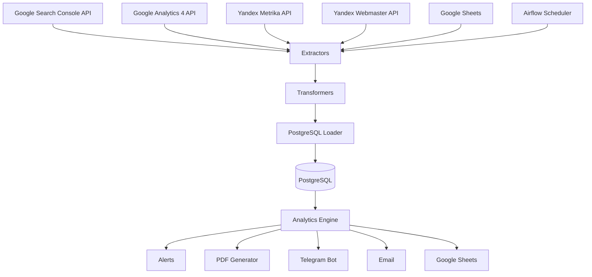

# Architecture Documentation

## System Overview

## Data Flow

1. **Extract** (Sundays 8:00 AM)
   - GSC: queries, pages, positions, CTR
   - GA4: sessions, users, revenue by page
   - Y.Metrika: visits, bounce rate, search phrases
   - Y.Webmaster: indexing problems
   - Sheets: cluster mappings

2. **Transform**
   - Normalize URLs
   - Map pages to clusters
   - Calculate pseudo-visibility with configurable weights
   - Aggregate by cluster/category

3. **Load**
   - Upsert to PostgreSQL (idempotent)
   - Separate raw and processed tables

4. **Analyze**
   - Compare current vs previous week
   - Generate alerts based on thresholds
   - Calculate tops (pages, clusters)

5. **Report**
   - Generate PDF via WeasyPrint
   - Send via Telegram + Email
   - Update Google Sheets

## Database Design

### Raw Data Layer
Stores unmodified API responses for audit and reprocessing.

### Processed Data Layer
Normalized, deduplicated, cluster-mapped data ready for analysis.

### Analytics Layer
Pre-computed metrics, alerts, and rankings for fast reporting.

## Scalability Considerations

- **Current**: Single worker, handles ~15K products
- **Future**: Add Celery workers for parallel extraction
- **Storage**: Partition tables by date for performance
- **API Limits**: Respect rate limits with exponential backoff
